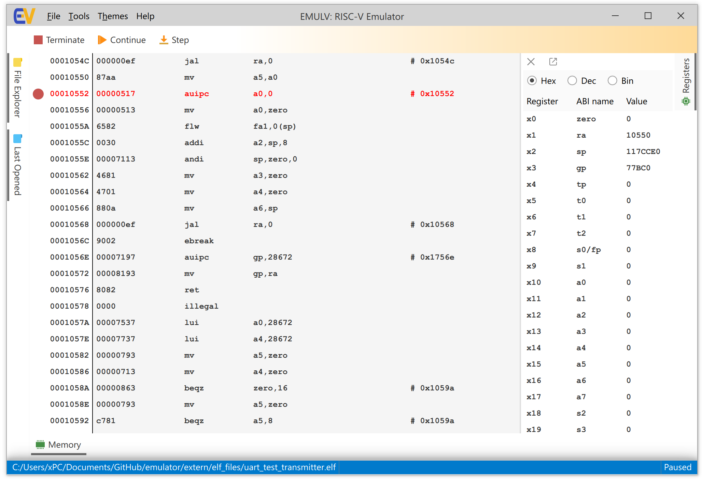
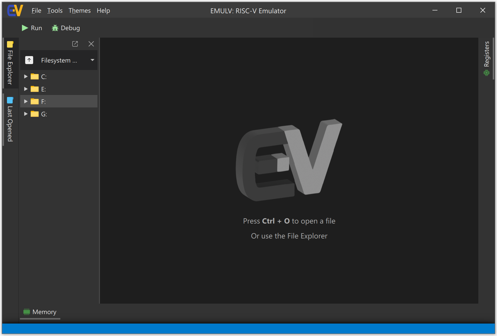
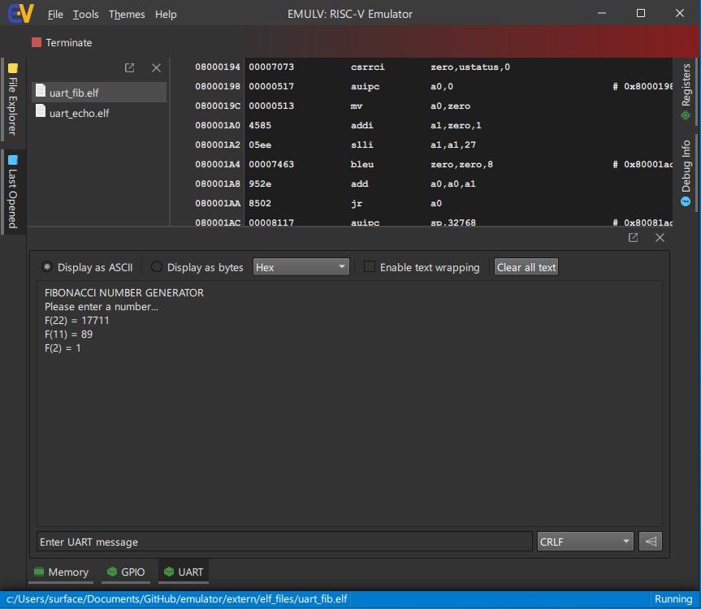

# Modular RISC-V Platform Emulator

* Readme last updated on: 07/07/2026

## About

This repository contains the source code for the **"Modular RISC-V Platform Emulator"** project, which was developed as part of a bachelor's thesis at the Faculty of Applied Sciences, University of West Bohemia in 2024.

The software is designed to provide an interactive desktop application for emulating the RISC-V instruction set and some hardware peripherals of the GD32VF103 Microcontroller.

Originally forked from a semestral project which served as an inspiration for this version of the emulator. 

## Introduction

The goal of this project was the design and implementation of a highly modular emulator environment that allows developers to simulate a RISC-V MCU board along with its memory-mapped input/output (I/O) peripherals. To address the tight coupling found in the previous implementation, this tool separates the core emulation logic from peripheral devices through a dynamic plugin architecture. Peripherals (such as GPIO and UART modules) are implemented within dynamically linked libraries (`.dll` on Windows or `.so` on Linux), enabling them to be discovered, configured, and loaded at runtime without altering or recompiling the core emulator.

The emulation of the core 32-bit RISC-V processor instruction set relies on the **libriscv** library , which offers extensible hooks for memory-mapped I/O registration. For the frontend, a modern cross-platform graphical user interface was built using **Qt Quick** and **QML**. This explicitly isolates the visual presentation and state tracking from the underlying execution backend, ensuring native high-DPI scaling, dark mode capabilites, and unified behavior across operating systems. The interface gives users real-time debugging capabilities, allowing them to view internal registers, explore disassembly, map memory sectors, and trace active peripherals side by side.

Reliability of the emulator was validated against physical hardware. A suite of embedded test programs (including LED blinks, UART echoes, and Fibonacci calculators) was compiled via the `rv32gc` toolchain tested both on this software solution and a physical **Sipeed Longan Nano** development board. The emulator successfully executed these test programs, matching the real hardware's execution behavior without any problems.

The thesis PDF can be viewed [here](https://github.com/jonas-s-s-s/emulator/blob/main/BP_text.pdf) (unfortunately only available in Czech language).

## The GUI

  
   
  <em>The main emulator window running on Linux (Ubuntu).</em>

  
   
  <em>Final version of the UI (light mode).</em>

  
   
  <em>Final version of the UI (dark mode).</em>

  
   
  <em>Example usage of the emulated UART i/o.</em>

## Project Structure

| Directory | Description |
| --- | --- |
| `src/` | Root directory of the emulator framework's source code. |
| `src/ui/` | Contains user interface assets and configuration files like `qtquickcontrols2.conf` and `resources.qrc`. |
| `src/ui/qml/` | Houses all QML files defining the layout, views, and structural logic of the graphical user interface. |
| `src/elf/` | Storage location for compiled ELF binary examples intended to be loaded and run inside the emulator. |
| `test/` | Contains the unit testing suites (using Google Test) and source files for embedded functional verification. |
| `doc/` | Contains supplementary project text, build materials, and Doxygen-generated documentation files. |

---

# Original Description (translated)

Modular RISC-V Platform Emulator for Educational Purposes (BP 2023/24)

## Assignment

Bachelor's thesis in the fields of Computer Science (Bc), Computer Engineering (Bc), and Information Systems (Bc).

**Modular RISC-V Platform Emulator for Educational Purposes**

1. Familiarize yourself with the RISC-V architecture and the most widespread implementations of its instruction set.
2. Analyze available solutions for the emulation and debugging of programs targeting this architecture.
3. Design a tool capable of emulating the RISC-V platform with the ability to define and configure peripherals independently of its core, and to perform debugging tasks.
4. Implement this tool as a modular framework, allowing peripherals to be defined within dynamically linked libraries.
5. Test the solution on a set of standard tasks and evaluate the achieved results.

| Topic Assigned By | Assigned for Academic Year | Assigned To |
| --- | --- | --- |
| Ing. Martin Úbl (UN 332) | 2023/2024 (on 2023-04-11) | Jonáš Dufek |

# Project Dependencies

## Operating System Libraries Required for Compilation

| Name | Purpose |
| --- | --- |
| Doxygen + GraphViz | Documentation generation |
| Qt 6.6 | GUI development library |

## The Following Libraries Are Automatically Downloaded via CMake

| Name | Link |
| --- | --- |
| libriscv | https://github.com/fwsGonzo/libriscv |
| doxygen-awesome-css | https://github.com/jothepro/doxygen-awesome-css |
| JSON for Modern C++ | https://github.com/nlohmann/json |
| riscv-disassembler | https://github.com/michaeljclark/riscv-disassembler |
| spdlog | https://github.com/gabime/spdlog |
| GoogleTest | https://github.com/google/googletest |
| qwindowkit | https://github.com/stdware/qwindowkit |
